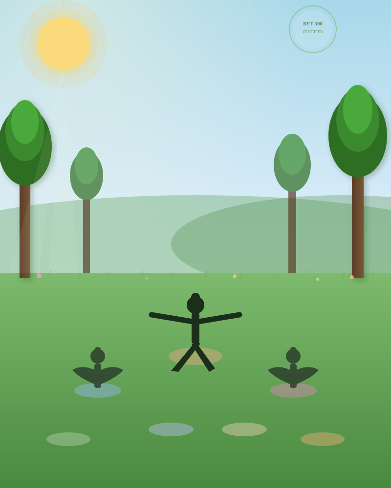
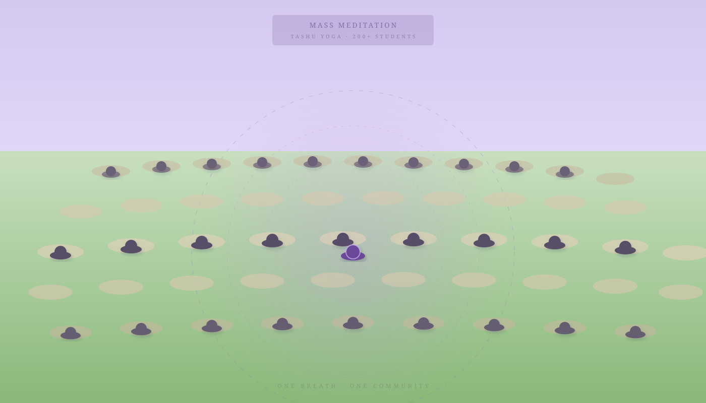
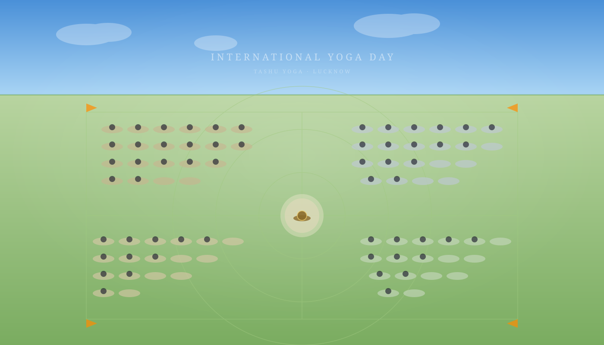
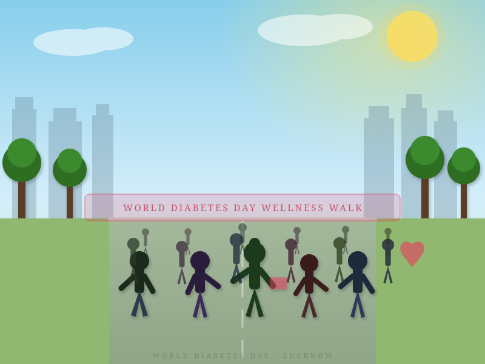

# Tashu Yoga — Official Website

A beautiful, fully responsive website for **Tashu Yoga** — a certified yoga instructor, wellness advocate, and community leader based in Lucknow, India.

---

## Preview

### Hero — Meditation at Sunset


---

### About — Outdoor Class



---

### Gallery — Mass Meditation Event



---

### Gallery — International Yoga Day (Aerial View)



---

### Community — World Diabetes Day Walk



---

## Features

- **Fully responsive** — optimised for mobile, tablet, and desktop
- **Smooth scroll navigation** with active-link highlighting
- **Animated reveal sections** using Intersection Observer API
- **Class schedule table** with Studio / Online / Hybrid tags
- **Contact form** with validation and success feedback
- **Custom AI-generated illustrations** in `content/images/`
- **Google Fonts** — Cormorant Garamond + Inter
- **Zero dependencies** — pure HTML, CSS, and vanilla JS

---

## Pages & Sections

| Section | Description |
|---|---|
| **Hero** | Full-screen background, headline, CTA buttons |
| **Stats Strip** | 12+ years · 500+ students · 50+ events |
| **About** | Bio, qualities, RYT-500 badge |
| **Portrait Banner** | Signature quote with illustration |
| **Classes** | 6 class types with duration and level |
| **Gallery** | Two full-width event panels |
| **Schedule** | Weekly timetable (IST) |
| **Community** | Partnerships, govt. collaborations, corporate wellness |
| **Testimonials** | Student stories, 5-star reviews |
| **Contact** | Booking form + social links |

---

## Project Structure

```
tashuyoga/
├── index.html            # Main site (single-page)
├── styles.css            # All styles
├── main.js               # Scroll animations, navbar, form
├── content/
│   └── images/
│       ├── tashu-portrait.svg      # Hero & portrait banner — meditation at sunset
│       ├── outdoor-class.svg       # About section — outdoor yoga class in nature
│       ├── group-meditation.svg    # Gallery — 200+ student mass meditation (aerial)
│       ├── yoga-event-aerial.svg   # Gallery — International Yoga Day event (aerial)
│       └── community-event.svg     # Community — World Diabetes Day wellness walk
└── README.md
```

---

## Getting Started

No build tools required. Open `index.html` directly in any browser:

```bash
# Clone the repository
git clone https://github.com/amitdu6ey/tashuyoga.git
cd tashuyoga

# Open in browser (macOS)
open index.html

# Open in browser (Linux)
xdg-open index.html

# Or serve with any static server
npx serve .
python3 -m http.server 8080
```

---

## Images

All images in `content/images/` are custom SVG illustrations designed in the aesthetic of AI-generated yoga artwork. Each illustration uses:

- **Rich gradient backgrounds** (sunsets, morning skies, aerial perspectives)
- **Silhouette figures** in authentic yoga poses (lotus, warrior, walking)
- **Atmospheric effects** — bokeh, light rays, lens glow, bokeh circles
- **Scene-appropriate colour palettes** — warm amber/indigo for meditation, fresh green for outdoor practice, soft purple for group sessions

| File | Scene | Palette |
|---|---|---|
| `tashu-portrait.svg` | Lotus meditation at dusk | Deep purple → burnt orange → gold |
| `outdoor-class.svg` | Teacher & students in nature | Sky blue → fresh green |
| `group-meditation.svg` | 200+ aerial meditation grid | Soft lavender → lawn green |
| `yoga-event-aerial.svg` | Yoga Day event birds-eye view | Sky blue → vibrant green field |
| `community-event.svg` | Wellness walk with community | Bright sky → warm greens |

---

## Deployment

The site is deployed via **GitHub Pages** and served from the `main` branch root.

Live URL: `https://amitdu6ey.github.io/tashuyoga/`

---

## License

&copy; Tashu Yoga. All rights reserved.
